# تحليل تدفق البيانات لصفحة HOME

## نظرة عامة على البنية

صفحة HOME (`src/app/page.jsx`) تتكون من 8 أقسام رئيسية، كل قسم له طريقة خاصة في جلب وعرض البيانات:

1. **BannerSection** - قسم البانر الرئيسي
2. **LatestItemsSection** - أحدث المنتجات
3. **OfferCards** - بطاقات العروض
4. **AboutUsSection** - قسم من نحن
5. **PopularDishes** - الأطباق الشائعة
6. **FoodMenuSection** - قائمة الطعام
7. **ChefSpecialSection** - توصيات الشيف
8. **ChefeSection** - قسم الشيفات

---

## مخطط تدفق البيانات العام

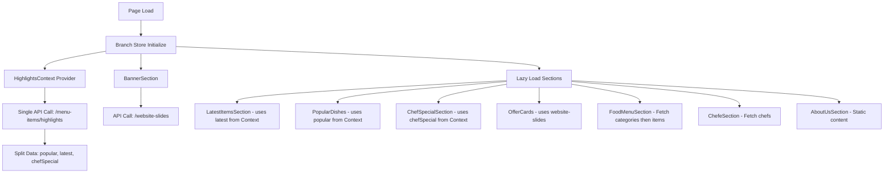

---

## 1. BannerSection (قسم البانر)

**الملف:** `src/components/pages/home/BannerSection.jsx`

### مخطط تدفق البيانات

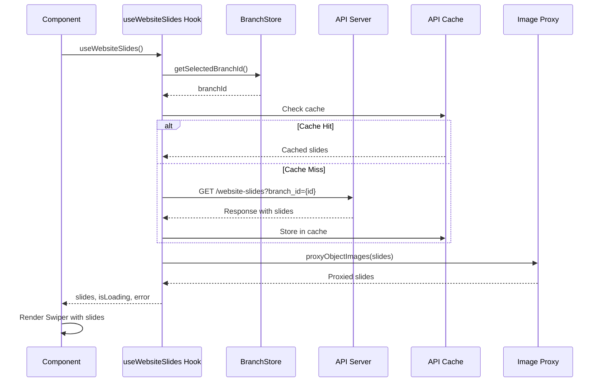

### التفاصيل:

- **Hook المستخدم:** `useWebsiteSlides()` من `src/hooks/useWebsiteSlides.js`
- **API Endpoint:** `/website-slides` مع `branch_id` كـ query parameter
- **Cache Strategy:** يستخدم `apiCache` utility مع TTL محدد
- **Image Processing:** جميع الصور تمر عبر `getProxiedImageUrl()` لحل مشاكل CORS
- **Performance:** 
  - Prefetch مبكر في `page.jsx` (useEffect)
  - Fetch API مع `priority: 'high'`
  - Preload للصورة الأولى لتحسين LCP

### البيانات المعروضة:

- `slide.title` - عنوان الشريحة
- `slide.description` - الوصف
- `slide.desktop_image` - صورة الشريحة (مع proxy)
- `slide.menu_item_id` - رابط إلى منتج معين (اختياري)

---

## 2. LatestItemsSection (أحدث المنتجات)

**الملف:** `src/components/pages/home/LatestItemsSection.jsx`

### مخطط تدفق البيانات

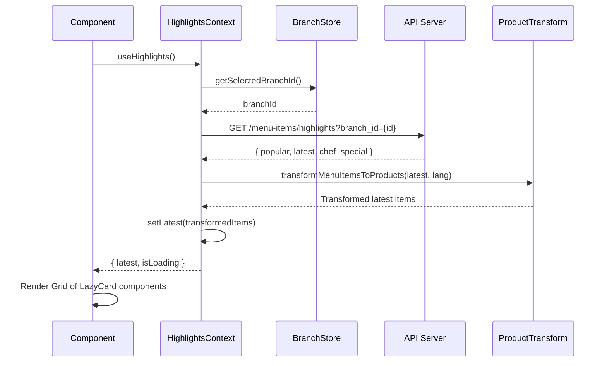

### التفاصيل:

- **Context:** `HighlightsContext` - يوفر البيانات لجميع الأقسام (Popular, Latest, ChefSpecial)
- **API Endpoint:** `/menu-items/highlights`
- **Data Transformation:** 
  - `transformMenuItemsToProducts()` - يحول API response إلى format المنتجات
  - `getLocalizedField()` - يجلب الحقول المترجمة (name_en, name_bg)
- **Lazy Loading:** يستخدم `useInView` hook - أول 3 بطاقات تحمل فوراً، الباقي عند الظهور
- **Performance:** 
  - Cache عبر `useApiCache` hook
  - Lazy loading للبطاقات غير المرئية

### البيانات المعروضة:

- `dish.title` - اسم المنتج (مترجم)
- `dish.description` - الوصف (مترجم)
- `dish.image` - صورة المنتج (مع proxy)
- `dish.price` - السعر
- `dish.id` - رابط إلى `/shop/{id}`

---

## 3. OfferCards (بطاقات العروض)

**الملف:** `src/components/pages/about-us/OfferCards.jsx`

### مخطط تدفق البيانات

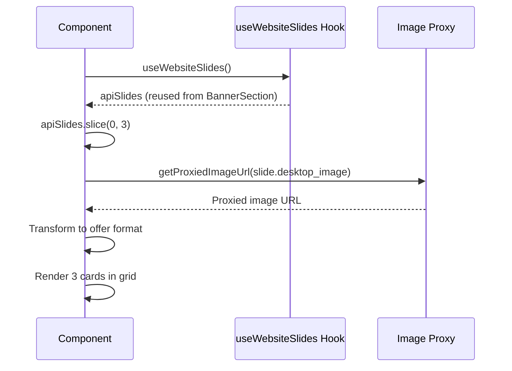

### التفاصيل:

- **Hook المستخدم:** `useWebsiteSlides()` - نفس البيانات المستخدمة في BannerSection
- **Data Reuse:** يعيد استخدام بيانات البانر (website-slides) - لا يوجد API call إضافي
- **Fallback:** إذا لم توجد بيانات، يعرض 3 بطاقات افتراضية
- **Image Processing:** `getProxiedImageUrl()` لجميع الصور

### البيانات المعروضة:

- أول 3 slides من website-slides
- كل بطاقة تحتوي على: title, image, link

---

## 4. AboutUsSection (قسم من نحن)

**الملف:** `src/components/pages/home/AboutUsSection.jsx`

### مخطط تدفق البيانات

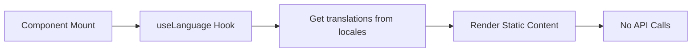

### التفاصيل:

- **لا يوجد API calls** - محتوى ثابت
- **Translations:** يستخدم `t(lang, "key")` من ملفات الترجمة
- **Content:** نص ثابت من `src/locales/en.json` و `src/locales/bg.json`
- **Images:** صور ثابتة من `/public/img/shape/`

### البيانات المعروضة:

- `t(lang, "about_us")` - العنوان الفرعي
- `t(lang, "about_us_title")` - العنوان الرئيسي
- `t(lang, "about_us_description")` - الوصف

---

## 5. PopularDishes (الأطباق الشائعة)

**الملف:** `src/components/pages/shop/PopularDishes.jsx`

### مخطط تدفق البيانات

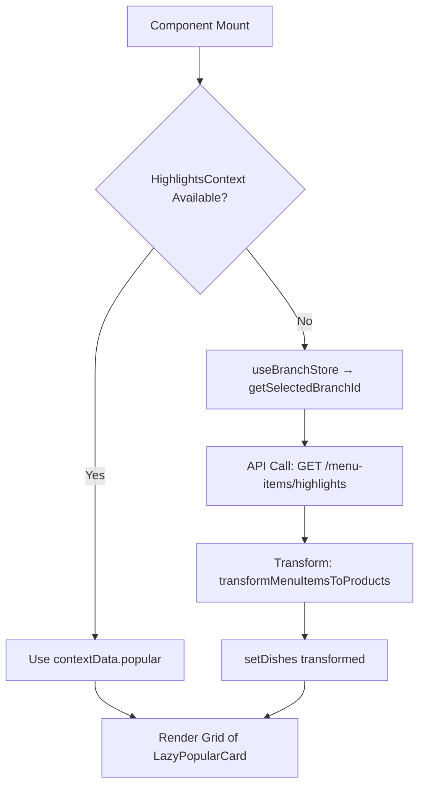

### التفاصيل:

- **Dual Strategy:** يحاول استخدام Context أولاً، إذا لم يكن متوفراً يجلب البيانات مباشرة
- **API Endpoint:** `/menu-items/highlights` - نفس API المستخدم في HighlightsContext
- **Data Transformation:** `transformMenuItemsToProducts()` مع اللغة الحالية
- **Lazy Loading:** `useInView` hook - أول 3 بطاقات فوراً، الباقي عند الظهور

### البيانات المعروضة:

- `dish.title` - اسم الطبق (مترجم)
- `dish.description` - الوصف (مترجم)
- `dish.image` - الصورة (مع proxy)
- `dish.price` - السعر

---

## 6. FoodMenuSection (قسم قائمة الطعام)

**الملف:** `src/components/pages/home/FoodMenuSection.jsx`

### مخطط تدفق البيانات

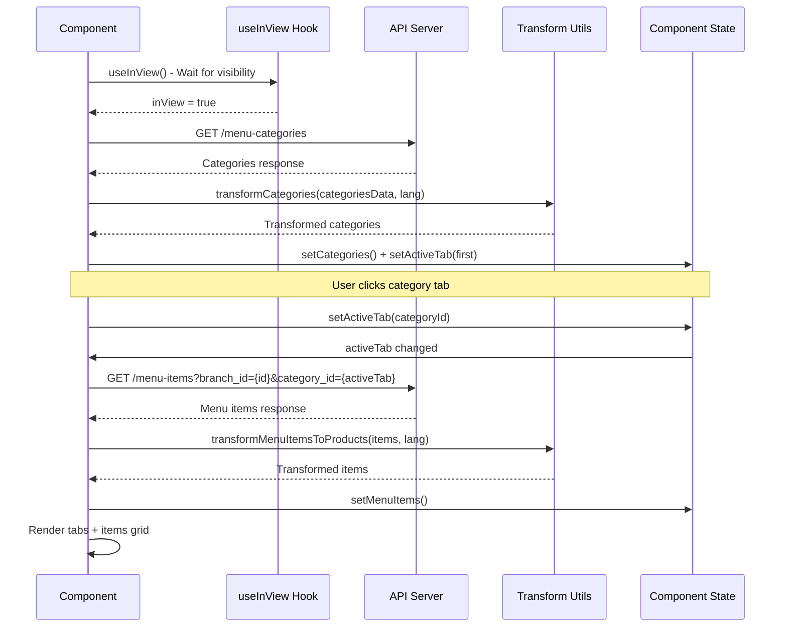

### التفاصيل:

- **Lazy Loading:** لا يجلب البيانات حتى يصبح القسم مرئياً (`useInView` مع `rootMargin: "200px"`)
- **Two-Step Fetch:**
  1. جلب الفئات أولاً (`/menu-categories`)
  2. جلب المنتجات عند اختيار فئة (`/menu-items?category_id={id}`)
- **State Management:**
  - `categories` - قائمة الفئات
  - `activeTab` - الفئة المختارة حالياً
  - `menuItems` - المنتجات للفئة المختارة
- **Data Transformation:**
  - `transformCategories()` - تحويل الفئات
  - `transformMenuItemsToProducts()` - تحويل المنتجات

### البيانات المعروضة:

- **Tabs:** قائمة بالفئات (مترجمة)
- **Content:** 10 منتجات من الفئة المختارة
  - صورة، اسم، وصف، سعر
  - رابط إلى `/shop/{id}`

---

## 7. ChefSpecialSection (توصيات الشيف)

**الملف:** `src/components/pages/home/ChefSpecialSection.jsx`

### مخطط تدفق البيانات

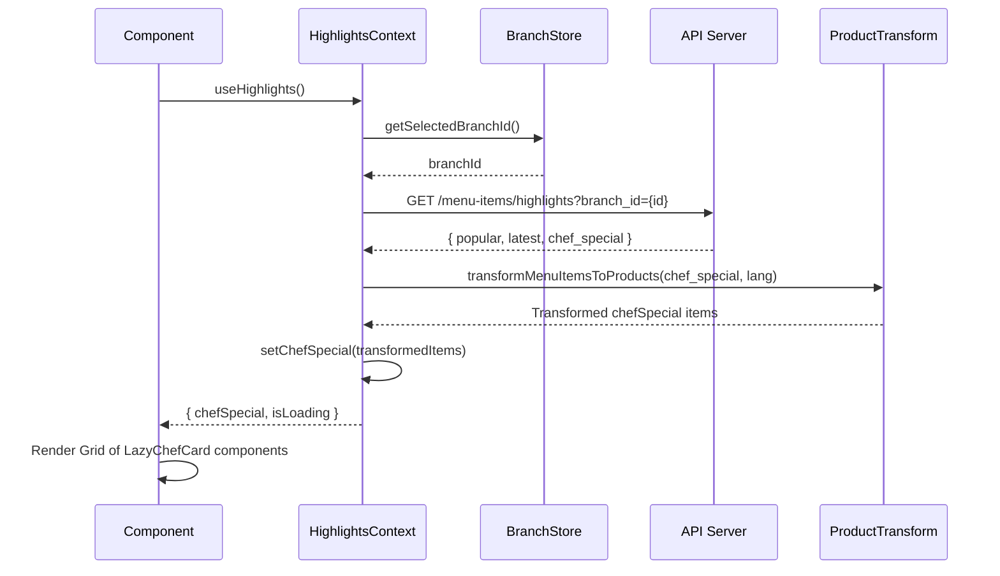

### التفاصيل:

- **Context:** يستخدم `HighlightsContext` - نفس البيانات المستخدمة في LatestItemsSection
- **API Endpoint:** `/menu-items/highlights` - نفس API
- **Data Source:** `response.data.chef_special` من نفس الـ response
- **Lazy Loading:** `useInView` hook - أول 3 بطاقات فوراً

### البيانات المعروضة:

- `dish.title` - اسم الطبق (مترجم)
- `dish.description` - الوصف (مترجم)
- `dish.image` - الصورة (مع proxy)
- `dish.price` - السعر
- Badge: "Special" مع أيقونة ChefHat

---

## 8. ChefeSection (قسم الشيفات)

**الملف:** `src/components/pages/about-us/ChefeSection.jsx`

### مخطط تدفق البيانات

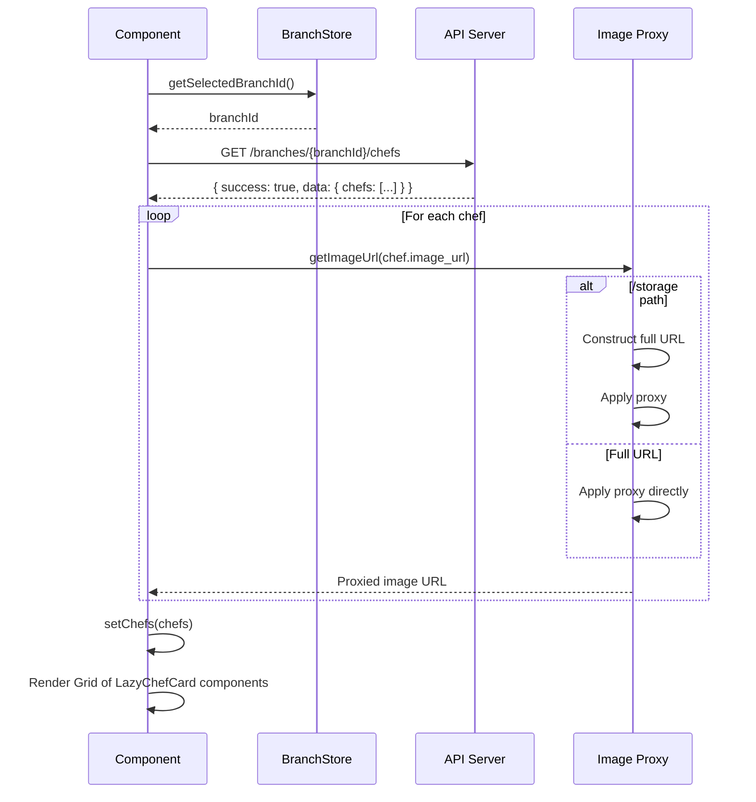

### التفاصيل:

- **API Endpoint:** `/branches/{branchId}/chefs` - endpoint خاص بالشيفات
- **Image Processing:** 
  - `getImageUrl()` - معالجة خاصة للصور
  - إذا كانت `/storage/...` → بناء URL كامل ثم proxy
  - إذا كانت URL كاملة → proxy مباشرة
- **Lazy Loading:** `useInView` hook - أول 3 بطاقات فوراً

### البيانات المعروضة:

- `chef.name` - اسم الشيف
- `chef.bio` - السيرة الذاتية (اختياري)
- `chef.image_url` - صورة الشيف (مع proxy)

---

## البنية المشتركة والـ Utilities

### 1. Branch Store (`src/store/branchStore.js`)

**الوظيفة:** إدارة الفروع المختارة

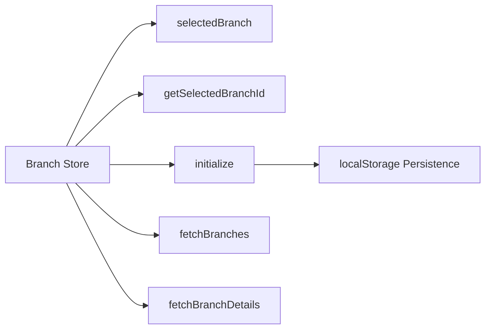

**Cache:** يستخدم localStorage للـ persistence

### 2. HighlightsContext (`src/context/HighlightsContext.jsx`)

**الوظيفة:** توفير البيانات المشتركة لـ 3 أقسام

```mermaid
flowchart TD
    A[HighlightsProvider] --> B[Single API Call]
    B --> C[/menu-items/highlights]
    C --> D[Response: popular, latest, chef_special]
    D --> E[Transform each section]
    E --> F[PopularDishes]
    E --> G[LatestItemsSection]
    E --> H[ChefSpecialSection]
```

**API Call:** واحد فقط - `/menu-items/highlights` - ثم تقسيم البيانات

### 3. Product Transform (`src/lib/utils/productTransform.js`)

**الوظيفة:** تحويل بيانات API إلى format المنتجات

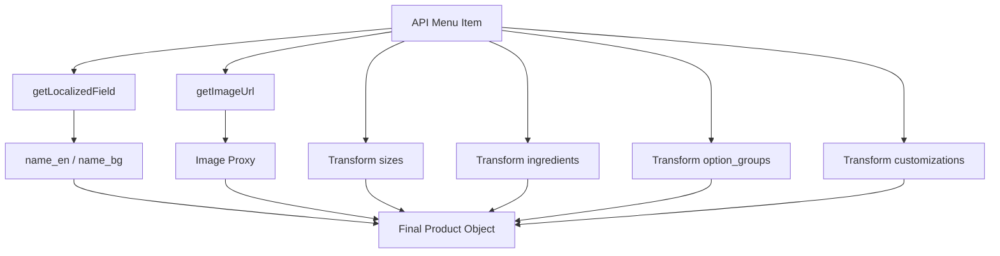

### 4. Image Proxy (`src/lib/utils/imageProxy.js`)

**الوظيفة:** حل مشاكل CORS للصور

```mermaid
flowchart TD
    A[Image URL] --> B{Is API Image?}
    B -->|Yes| C[/api/images/[...path]]
    B -->|No| D[Return as is]
    C --> E[Proxied URL]
    D --> E
```

### 5. API Cache (`src/lib/utils/apiCache.js`)

**الوظيفة:** تخزين مؤقت للـ API responses

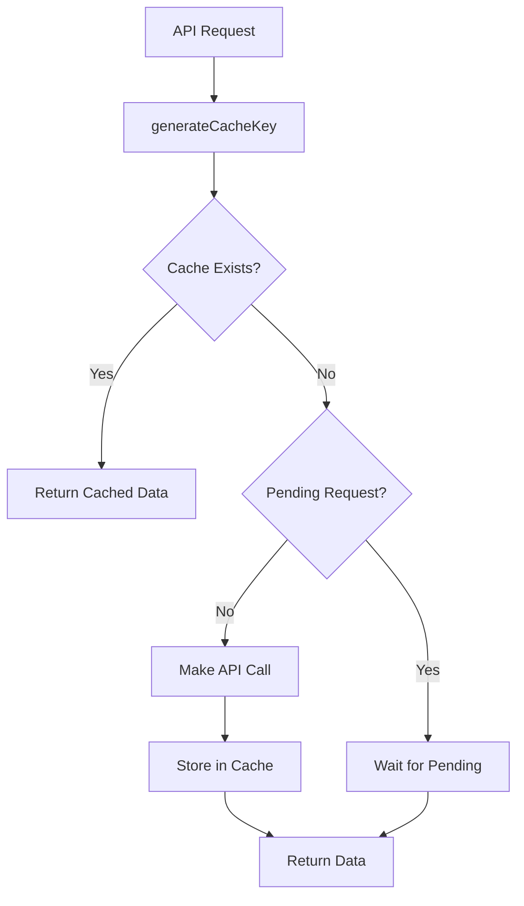

---

## ترتيب تحميل الأقسام

```mermaid
gantt
    title Home Page Section Loading Order
    dateFormat X
    axisFormat %s
    
    section Immediate
    BannerSection :0, 1
    
    section Priority 1
    PopularDishes :2, 3
    FoodMenuSection :2, 3
    ChefSpecialSection :2, 3
    
    section Priority 3
    LatestItemsSection :4, 5
    OfferCards :4, 5
    ChefeSection :4, 5
    
    section Lightweight
    AboutUsSection :6, 7
```

1. **BannerSection** - فوراً (Above the fold)
2. **LatestItemsSection** - Lazy load (Priority 3)
3. **OfferCards** - Lazy load (Priority 3)
4. **AboutUsSection** - Lazy load (SSR enabled)
5. **PopularDishes** - Lazy load (Priority 1)
6. **FoodMenuSection** - Lazy load (Priority 1)
7. **ChefSpecialSection** - Lazy load (Priority 1)
8. **ChefeSection** - Lazy load (Priority 3)

---

## ملخص تدفق البيانات الكامل

```mermaid
flowchart TD
    Start[Page Load] --> Init[Branch Store Initialize]
    Init --> HC[HighlightsContext Provider]
    HC --> API1[Single API: /menu-items/highlights]
    API1 --> Split[Split: popular, latest, chefSpecial]
    
    Init --> Banner[BannerSection]
    Banner --> API2[API: /website-slides]
    API2 --> BannerRender[Render Swiper]
    
    Split --> Latest[LatestItemsSection]
    Split --> Popular[PopularDishes]
    Split --> ChefSpecial[ChefSpecialSection]
    
    API2 --> Offers[OfferCards - Reuse slides]
    
    Init --> FoodMenu[FoodMenuSection]
    FoodMenu --> API3[API: /menu-categories]
    API3 --> API4[API: /menu-items?category_id]
    API4 --> FoodMenuRender[Render Tabs + Items]
    
    Init --> Chefs[ChefeSection]
    Chefs --> API5[API: /branches/{id}/chefs]
    API5 --> ChefsRender[Render Chef Cards]
    
    Init --> About[AboutUsSection]
    About --> Static[Static Content - No API]
    
    style Start fill:#e1f5ff
    style API1 fill:#fff4e1
    style API2 fill:#fff4e1
    style API3 fill:#fff4e1
    style API4 fill:#fff4e1
    style API5 fill:#fff4e1
    style Static fill:#e8f5e9
```

**ملاحظات مهمة:**

- معظم الأقسام تستخدم lazy loading لتحسين الأداء
- HighlightsContext يوفر بيانات لـ 3 أقسام من API call واحد
- جميع الصور تمر عبر proxy لحل مشاكل CORS
- Cache strategy لتقليل API calls
- Localization: جميع النصوص والمنتجات مترجمة حسب اللغة المختارة

---

## API Endpoints المستخدمة

| Endpoint | Method | Sections Using It | Description |
|----------|--------|-------------------|-------------|
| `/website-slides` | GET | BannerSection, OfferCards | جلب شرائح البانر |
| `/menu-items/highlights` | GET | LatestItemsSection, PopularDishes, ChefSpecialSection | جلب المنتجات المميزة |
| `/menu-categories` | GET | FoodMenuSection | جلب فئات القائمة |
| `/menu-items` | GET | FoodMenuSection | جلب منتجات فئة معينة |
| `/branches/{id}/chefs` | GET | ChefeSection | جلب الشيفات |

---

## State Management Flow

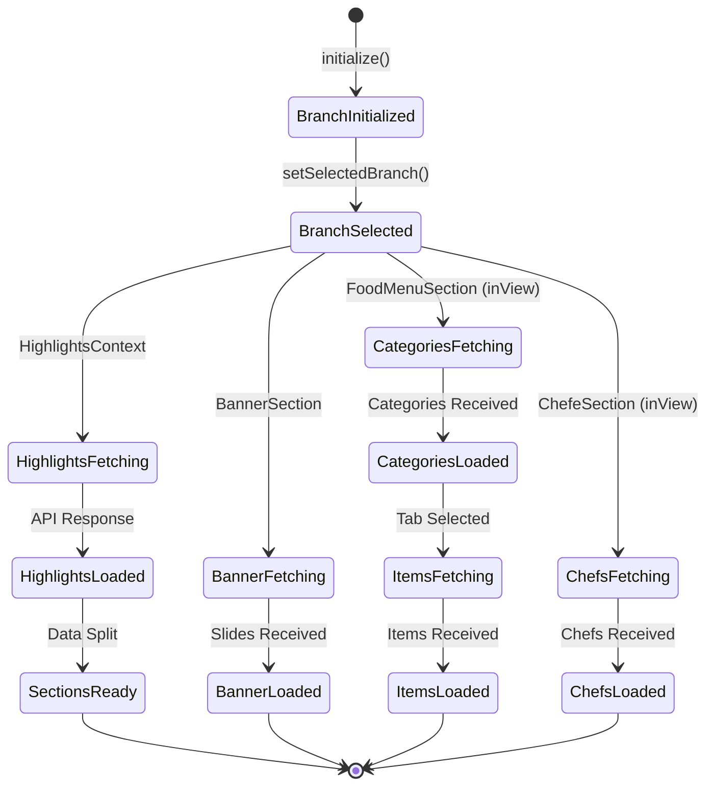

---

## Performance Optimizations

1. **Lazy Loading:** معظم الأقسام تحمل فقط عند الحاجة
2. **Code Splitting:** استخدام `dynamic()` import في Next.js
3. **Image Optimization:** 
   - Proxy للصور الخارجية
   - Lazy loading للصور
   - Preload للصور المهمة
4. **Caching:**
   - API responses cached
   - Branch data persisted in localStorage
5. **Request Deduplication:** منع duplicate API calls
6. **Intersection Observer:** تحميل البيانات عند ظهور القسم


